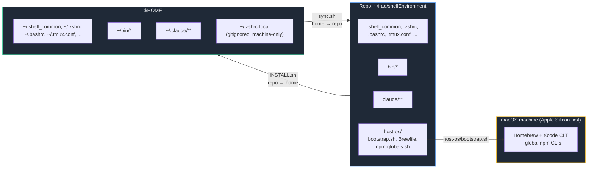
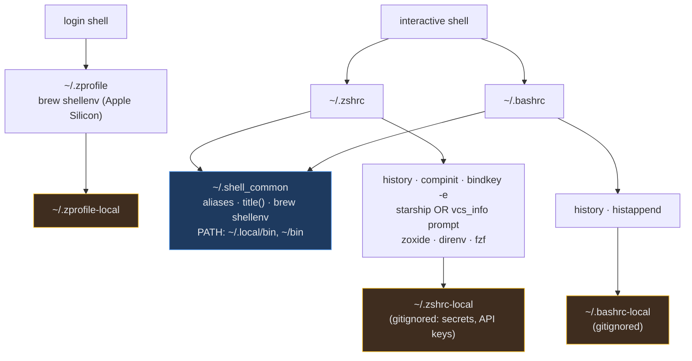
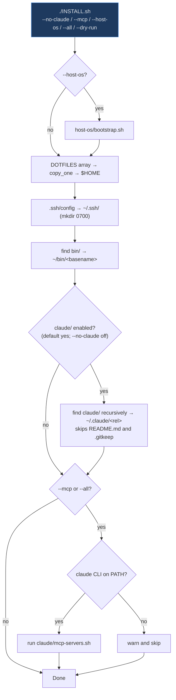
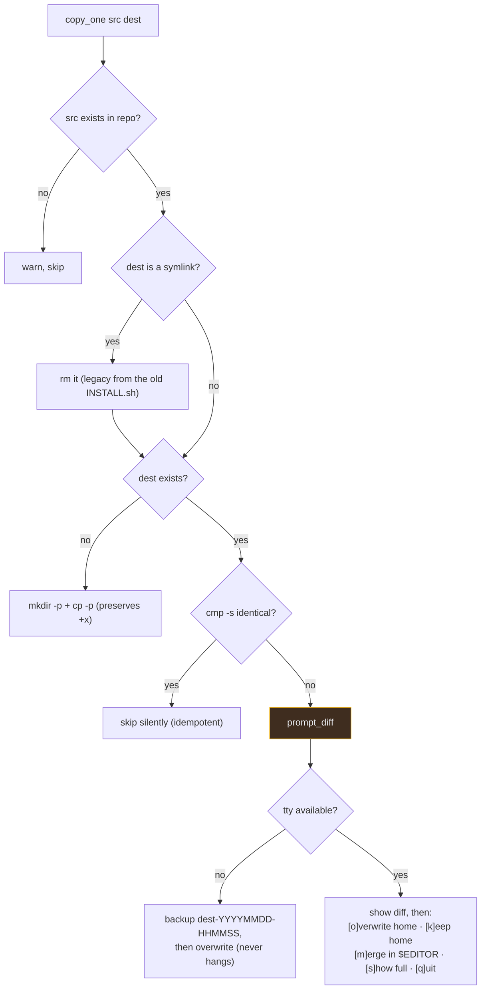
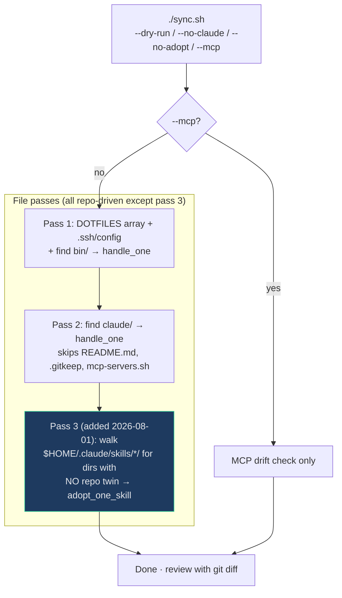
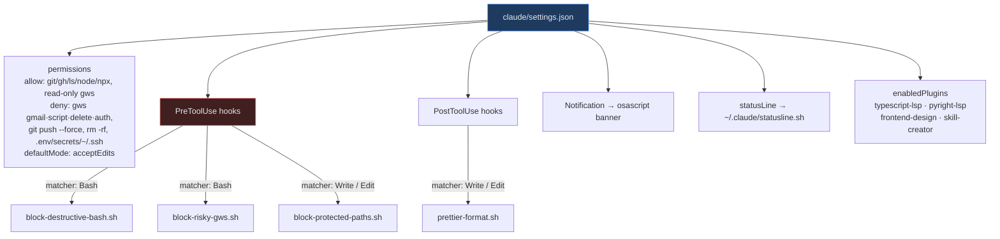

# Architecture

**Last updated:** 2026-08-08

This repo is not an application. It is a **two-way file-copy system** between a git repo and
`$HOME`, plus a one-shot machine bootstrap. There is no build, no test runner, no linter; the
"runtime" is Bash. This document describes the moving parts and the direction data flows.

Companion to [`CLAUDE.md`](../CLAUDE.md), which carries the working rules. Several facts appear in
both — the copies-not-symlinks rule, `sync.sh`'s discovery blind spot, the `~line` numbers for the
duplicated `DOTFILES` array. Change one, change the other in the same commit.

---

## 1. The core model

Three scripts, three directions. Everything else is data they move.



| Script                 | Direction      | Entry point                                  |
| ---------------------- | -------------- | -------------------------------------------- |
| `host-os/bootstrap.sh` | repo → machine | Xcode CLT, Homebrew, `Brewfile`, npm globals |
| `INSTALL.sh`           | repo → `$HOME` | Fresh machine, or applying a `git pull`      |
| `sync.sh`              | `$HOME` → repo | Capturing an edit made to the live config    |

**Files are real copies, not symlinks.** `copy_one()` in `INSTALL.sh` does `cp -p`. Deleting the
repo must not break the live shell or `~/.claude/`.

**The scripts are the interface.** Editing a tracked file inside the repo changes nothing live,
and the next `sync.sh` will offer to overwrite the edit with the stale `$HOME` version.

---

## 2. Repo layout

```
shellEnvironment/
├── INSTALL.sh              repo → $HOME  (240 lines)
├── sync.sh                 $HOME → repo  (326 lines)
├── CLAUDE.md               agent instructions for this repo (repo-only)
├── README.md, LICENSE, .gitignore        (repo-only)
│
├── host-os/                one-shot macOS bootstrap (Darwin-only, aborts otherwise)
│   ├── bootstrap.sh        Xcode CLT → Homebrew → brew bundle → npm-globals
│   ├── Brewfile            declarative package list
│   └── npm-globals.sh      eas-cli, @googleworkspace/cli, @anthropic-ai/claude-code
│
├── bin/                    → ~/bin (on PATH via .shell_common)
│   ├── gh-newrepo          create a GitHub repo at the standard settings
│   └── irad-push-private   rsync gitignored/untracked ~/irad data to another host
│
├── claude/                 → ~/.claude/  (the tracked subset)
│   ├── CLAUDE.md, investigations.md      global agent instructions
│   ├── rules/personal.md                 git/PR/communication preferences
│   ├── settings.json                     permissions + hook wiring + statusline
│   ├── statusline.sh
│   ├── hooks/                            scripts referenced from settings.json
│   ├── agents/                           code-reviewer, debugger, pr, test-writer
│   ├── commands/bugfix.md
│   ├── skills/                           cabin, checkpoint, code-analysis,
│   │                                     investigate, pr, silent-change-audit,
│   │                                     test, weekly-digest
│   └── mcp-servers.sh                    generator, NOT a mirrored file
│
└── dotfiles (repo root)
    ├── .shell_common       everything portable: aliases, title(), brew shellenv, PATH
    ├── .zshrc / .bashrc    shell-specific, each sources .shell_common
    ├── .zprofile           login-shell PATH/env
    ├── .tmux.conf / .tmux.reset / .screenrc / .gitconfig
    └── .ssh/config         handled separately (lives under ~/.ssh/, mode 0700)
```

One orphan: `.tmux.conf-orig` is tracked by git but appears in **neither** `DOTFILES` array, so
`INSTALL.sh` never copies it out and `sync.sh` never looks for it. It is a reference copy only, not
part of either flow.

The repo-root `.claude/settings.local.json` is project-scope Claude state created in the working
directory. `.gitignore` excludes `/.claude/` precisely so it does not collide with the tracked
`claude/` directory (no leading dot).

---

## 3. Shell config: the sourcing chain

Three layers, each one able to override the last. Machine-local values always win because they
are sourced last.



`.shell_common` is the DRY boundary: anything that works in both bash and zsh lives there and is
written POSIX-ish. Shell-specific syntax (`setopt`, `zstyle`, `shopt`) stays in the per-shell file.

Secrets and per-machine values never enter the repo. `.gitignore` excludes `*-local` and `*.local`,
and every shared file sources its `-local` twin at the end.

---

## 4. `INSTALL.sh`: repo → `$HOME`



**`claude/` is copied on every run.** It used to sit behind `--claude` while `sync.sh` walked
`claude/` by default, so a plain `./INSTALL.sh` applied strictly less than a plain `./sync.sh`
captured. Both directions now default to the same set: dotfiles + `bin/` + `claude/`. `--claude`
is still accepted as a no-op.

**MCP registration is separate and opt-in** (`--mcp`, or `--all`). It is not a file copy: it
shells out to `claude mcp remove` + `claude mcp add`, needs the network, and needs the keys from
`~/.zshrc-local` — `mcp-servers.sh` runs under `set -u` and aborts if `STRIPE_SECRET_KEY` is
unset. Tying that to every dotfile refresh would make a routine run fail on a machine that has no
keys yet.

### `copy_one(src, dest)`, the one decision function



Nothing is overwritten without an explicit `o`, or a save during `m` that makes the files match.

---

## 5. `sync.sh`: `$HOME` → repo

Same prompt shape as `INSTALL.sh`, mirrored: `[o]verwrite **repo**`. Three passes plus a separate
MCP mode.



### `handle_one(home, repo)`

| Condition            | Behavior                                                                  |
| -------------------- | ------------------------------------------------------------------------- |
| missing at home      | warn, skip (the repo has something `$HOME` does not)                      |
| symlink at home      | warn, skip (convert it first)                                             |
| identical (`cmp -s`) | skip silently                                                             |
| `--dry-run`          | print `diverges: <rel>`                                                   |
| differs              | show diff, prompt `[o]verwrite repo / [k]eep / [m]erge / [s]how / [q]uit` |

### The structural blind spot

**Passes 1 and 2 are repo-driven.** They enumerate files that already exist _in the repo_ and go
looking for the `$HOME` twin. A file created only at `$HOME`, with no repo counterpart, is
therefore invisible.

This has silently dropped work twice: an entire `~/.claude/hooks/` directory plus three skills
(`a46cc88`), then `silent-change-audit` and `weekly-digest` a day later.

Pass 3 closes exactly one hole: skill _directories_. `adopt_one_skill` offers any
`~/.claude/skills/<name>/` with no repo twin via `[a]dopt / [k]eep out / [v]iew / [q]uit`, and it
consults `git check-ignore` per directory **and** per file, so a skill can be adoptable while some
of its contents (local identifiers, generated baselines) stay out. Symlinked skills are skipped:
those are owned by other repos, and copying them here would fork them. `--no-adopt` disables it.

Everything else remains blind. New files under `~/bin`, `~/.claude/hooks/`, `agents/`, `commands/`,
`rules/`, and any new dotfile must be copied into the repo **by hand once**. Only then does
`sync.sh` track them.

### MCP drift mode (`--mcp`)

Compares the server names from `claude mcp list` against the `add_user_mcp <name>` lines in
`claude/mcp-servers.sh`, and reports each direction. `claude.ai `-prefixed entries are excluded
because those follow the claude.ai account, not this file.

**Drift detection is name-only.** The same name pointing at a different command on each side is
not flagged.

---

## 6. The `claude/` domain

`claude/` is the tracked subset of `~/.claude/`. Runtime state (`sessions/`, `projects/`, caches,
`*.jsonl`) is gitignored; only configuration is tracked.



(The two `Write / Edit` matchers above are written `"Write|Edit"` in `settings.json`; the slash is
only to keep the diagram parseable.)

**Two enforcement layers, deliberately overlapping.** `permissions.deny` in `settings.json` can be
overridden per project; a `PreToolUse` hook exiting `2` cannot. The hooks duplicate part of the deny
list on purpose, because they are the layer that actually enforces.

Each hook script carries its own known-limitations block. Notably `block-destructive-bash.sh`
matches patterns against the raw command **string**, so `rm -rf /Users/me/scratch` is blocked as if
it were root deletion, while `rm -fr /` passes through. Over-blocking is the safe failure direction,
which is why it is documented rather than urgently fixed.

`prettier-format.sh` resolves prettier in a deliberate order: the file's own project first (a repo
that installed prettier opted in, so format any supported extension), then the hook-local install
(repo did not opt in, so markdown only), and it self-bootstraps `npm ci` in `~/.claude/hooks` once,
behind an atomic mkdir lock and a 120s watchdog.

### MCP servers

`claude/mcp-servers.sh` is a **generator, not a mirrored file** (which is why `sync.sh` skips it).
It removes-then-adds each user-scope server, so it is idempotent. It stores no secrets: keys come
from `$STRIPE_SECRET_KEY` and friends, set in the gitignored `~/.zshrc-local`. It deliberately does
not touch OAuth flows (per-machine by design), claude.ai-managed servers (Gmail, Drive, Calendar),
or project-scope servers in a project's own `.mcp.json`.

---

## 7. Invariants worth preserving

1. **Copies, not symlinks.** Deleting this repo must leave a working shell and `~/.claude/`.
2. **Idempotent and non-destructive.** Identical files skip; differing files prompt; nothing is
   overwritten without explicit consent (or, non-interactively in `INSTALL.sh` only, a timestamped
   backup first).
3. **`--dry-run` on both scripts** changes nothing.
4. **The `DOTFILES=(...)` array is duplicated** in `INSTALL.sh` (~line 169) and `sync.sh`
   (~line 223). Adding or removing a tracked dotfile means editing **both**, or the two directions
   fall out of sync. `bin/` and `claude/` have no such array; they are walked with `find`.
5. **Secrets never enter the repo.** They live in `*-local` files sourced last.
6. **`sync.sh` cannot discover most new files.** New files outside `~/.claude/skills/` must be
   copied in by hand once.
7. **`claude/settings.json` churns.** Claude Code rewrites it on plugin/permission changes. Review
   the diff before committing.
